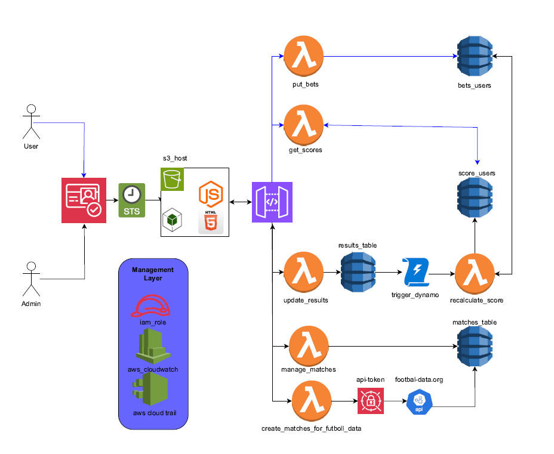

# Aplicación Serverless con AWS y Terraform

¡Bienvenido a este proyecto serverless! Este repositorio contiene una aplicación de apuestas deportivas nativa de la nube construida utilizando servicios de AWS e Infraestructura como Código (IaC) con Terraform. El objetivo de este proyecto es demostrar una arquitectura serverless e invitar a la comunidad a contribuir con ideas y mejoras.

## Tabla de Contenidos

1. [Descripción General](#descripción-general)
2. [Arquitectura](#arquitectura)
3. [Requisitos Previos](#requisitos-previos)
4. [Instrucciones de Configuración](#instrucciones-de-configuración)
5. [Pruebas de la Aplicación](#pruebas-de-la-aplicación)
6. [Contribuciones](#contribuciones)

---

## Descripción General

Este proyecto demuestra una arquitectura serverless utilizando los servicios de AWS, incluyendo:

- **AWS Lambda**: Lógica del backend.
- **API Gateway**: Gestión de API.
- **DynamoDB**: Almacenamiento de datos.
- **S3**: Hosting de archivos estáticos.
- **Cognito**: Servicio para autenticación y autorización de usuarios.
- **CloudFront**: Red de distribución de contenido (CDN). (Proximo mvp)

Está diseñado para ser implementado fácilmente utilizando Terraform, lo que permite un aprovisionamiento consistente de la infraestructura.

## Arquitectura



La aplicación consiste en un frontend alojado en S3/CloudFront y un backend con API Gateway y Lambda, interactuando con DynamoDB para la persistencia de datos.

## Requisitos Previos

Antes de desplegar el proyecto, asegúrate de tener lo siguiente:

- [Terraform](https://www.terraform.io/downloads.html) instalado.
- AWS CLI instalado y configurado con los permisos adecuados de IAM.
- Una cuenta de AWS.
- Una cuenta en [football-data.org](https://football-data.org/) para obtener un token de API.

## Instrucciones de Configuración

Sigue estos pasos para desplegar el proyecto:

1. **Clona el repositorio**:
   ```bash
   git clone https://github.com/AndersonD93/project_bets_manager
   cd terraform
   ```

2. **Crea un secreto en AWS Secrets Manager**:
   Ve a la consola de AWS Secrets Manager y crea un secreto con el nombre `project/footbal-data` que contenga la siguiente estructura:
   ```json
   {
       "X-Auth-Token": "<TU_API_TOKEN>"
   }
   ```
   Reemplaza `<TU_API_TOKEN>` con el token proporcionado por football-data.org.

3. **Crea el archivo `config.js`**:
   Crea un archivo llamado `config.js` en la carpeta `templates/js` con el siguiente contenido: (Este generara de forma dinamica la url requerida para la obtención de secretos)
   ```javascript
   const config = {
       development: {
           apiUrlSecrets: "${url_invoke_api}"
       }
   };

   const environment = 'development';

   export default config[environment];
   ```
4. **Inicializa Terraform usando el backend local**:
   Comenta el bloque `backend` en el archivo `main.tf` y ejecuta los siguientes comandos para aprovisionar los recursos iniciales:
   ```bash
   terraform init
   terraform plan
   terraform apply
   ```

5. **Configura el backend remoto en Terraform(Opcional)**:
   Descomenta el bloque `backend` en el archivo `main.tf`(Opcional si quieres manejar tu backend en forma remota):
   ```hcl
   terraform {
       backend "s3" {
           bucket         = "mi-bucket-unico-para-tf-state"
           key            = "tf-infra/terraform.tfstate"
           region         = "us-east-1"
           encrypt        = true
           dynamodb_table = "terraform-state-locking-ajduran2"
       }
   }
   ```
   Además, modifica la línea bucket_name dentro del módulo tf-state en main.tf para que coincida con el nombre del bucket configurado:

   ```hcl
      module "tf-state" {
      source      = "./modules/tf-state"
      bucket_name = "mi-bucket-unico-para-tf-state"
   }
   ```
   Luego, vuelve a inicializar y aplica los cambios:
   ```bash
   terraform init
   terraform apply
   ```

6. **Personaliza las variables**:
   Actualiza el archivo `variables.tf` o proporciona un archivo `terraform.tfvars` con tu configuración:
   ```hcl
   region = "us-east-1"
   project = "bets-manager"
   ```

7. **Despliega la infraestructura**:
   ```bash
   terraform apply
   ```
   Confirma los cambios escribiendo `yes` cuando se te solicite.

8. **Accede a la aplicación**:
   Una vez desplegado, Terraform mostrará información relevante, incluyendo la URL de CloudFront para el frontend y el endpoint de API Gateway.

## Pruebas de la Aplicación

1. Abre la URL del frontend en tu navegador.
2. Usa la interfaz para interactuar con la API backend (por ejemplo, enviando solicitudes, viendo respuestas).
3. También puedes probar la API directamente usando herramientas como Postman o curl.

## Contribuciones

¡Las contribuciones son bienvenidas! Aquí tienes cómo puedes ayudar:

1. **Reporta Problemas**: Usa la pestaña Issues para reportar errores o sugerir funcionalidades.
2. **Haz un Fork del Repositorio**: Realiza tus cambios y crea un pull request.
3. **Propón Ideas**: Comparte tus ideas para mejorar el proyecto en la pestaña Discussions.

### Directrices

- Asegúrate de documentar los cambios realizados en el código.
- Sigue el estilo y la estructura del código existente.
- Incluye pruebas para cualquier nueva funcionalidad.

---

¡No dudes en contactarme si tienes preguntas o comentarios! Construyamos algo increíble juntos 🚀.
