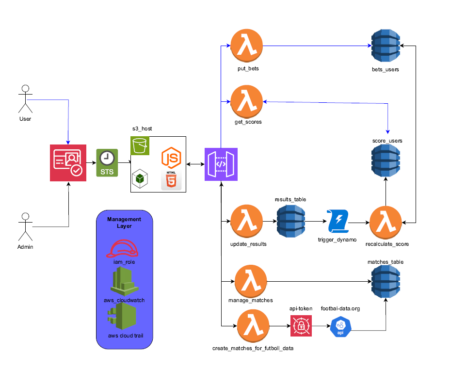

# Bets Manager — Aplicación Serverless de Apuestas Deportivas

Aplicación serverless de apuestas deportivas construida sobre AWS con Terraform como IaC y React + Vite como frontend.

## Tabla de Contenidos

1. [Descripción General](#descripción-general)
2. [Arquitectura](#arquitectura)
3. [Stack Tecnológico](#stack-tecnológico)
4. [Requisitos Previos](#requisitos-previos)
5. [Instrucciones de Despliegue](#instrucciones-de-despliegue)
6. [Desarrollo Frontend](#desarrollo-frontend)
7. [URLs de Acceso](#urls-de-acceso)
8. [Contribuciones](#contribuciones)

---

## Descripción General

Plataforma que permite a usuarios autenticados apostar en partidos de fútbol. Los administradores gestionan partidos y resultados; los usuarios generales realizan apuestas y consultan el ranking. El sistema calcula puntajes automáticamente vía DynamoDB Streams.

---

## Arquitectura



```
React (S3 + CloudFront HTTPS)
        │
        ▼
API Gateway (REST, REGIONAL)  ←  Cognito Authorizer (JWT)
        │
        ▼
AWS Lambda (Python 3.12)
        │
        ▼
DynamoDB  ←  Streams → recalculate_score Lambda
        │
Secrets Manager  ·  Cognito User Pool
```

---

## Stack Tecnológico

| Capa | Tecnología |
|---|---|
| Frontend | React 18 + Vite 4 + React Router 6 |
| Auth | AWS Cognito (SRP) + amazon-cognito-identity-js |
| API | AWS API Gateway REST (Regional) |
| Backend | AWS Lambda Python 3.12 |
| Base de datos | AWS DynamoDB (on-demand) |
| CDN / HTTPS | AWS CloudFront + S3 (OAC) |
| Secretos | AWS Secrets Manager |
| IaC | Terraform 1.x |
| Estado Terraform | S3 + DynamoDB locking |

---

## Requisitos Previos

- [Terraform](https://www.terraform.io/downloads.html) >= 1.0
- [Node.js](https://nodejs.org/) >= 18
- AWS CLI configurado con permisos IAM adecuados
- Cuenta en [football-data.org](https://football-data.org/) para el API token

---

## Instrucciones de Despliegue

### 1. Clonar el repositorio

```bash
git clone https://github.com/AndersonD93/project_bets_manager
```

### 2. Crear secreto en Secrets Manager

En la consola AWS crea un secreto llamado `project/footbal-data`:

```json
{ "X-Auth-Token": "<TU_API_TOKEN>" }
```

### 3. Build del frontend

```bash
cd frontend
npm install
npm run build
```

### 4. Inicializar Terraform (backend local primero)

Comenta el bloque `backend "s3"` en `terraform/main.tf` y ejecuta:

```bash
cd terraform
terraform init
terraform apply
```

### 5. Activar backend remoto (opcional)

Descomenta el bloque `backend "s3"` en `main.tf` y actualiza el `bucket_name` en el módulo `tf-state`. Luego:

```bash
terraform init
terraform apply
```

### 6. Subir frontend a S3

```bash
aws s3 sync frontend/dist s3://<BUCKET_NAME> --delete --cache-control "no-cache"
```

### 7. Invalidar caché CloudFront (tras cada deploy)

```bash
aws cloudfront create-invalidation \
  --distribution-id <CLOUDFRONT_DISTRIBUTION_ID> \
  --paths "/*"
```

---

## Desarrollo Frontend

```bash
cd frontend
npm install
```

Crea un archivo `.env.local` con:

```
VITE_API_URL=https://i86otm11l7.execute-api.us-east-1.amazonaws.com/prd
```

Luego:

```bash
npm run dev
```

### Estructura del frontend

```
frontend/
├── src/
│   ├── api/          # Llamadas a API Gateway
│   ├── context/      # AuthContext (Cognito + sesión)
│   ├── components/   # Navbar, ProtectedRoute
│   └── pages/        # Login, Admin, Matches, Results, Bets, Scores
├── .env.production   # VITE_API_URL para build
└── vite.config.js
```

### Rutas

| Ruta | Rol | Descripción |
|---|---|---|
| `/` | Todos | Login |
| `/admin` | admin | Crear partido manual |
| `/matches` | admin | Importar partidos desde football-data.org |
| `/results` | admin | Actualizar resultado de partido |
| `/bets` | general | Realizar apuesta |
| `/scores` | general | Ver ranking de puntajes |

---

## URLs de Acceso

| Recurso | URL |
|---|---|
| Frontend (HTTPS) | `https://<CLOUDFRONT_DOMAIN>.cloudfront.net` |
| Frontend (HTTP) | `http://bets-manager-host-s3-bets-manager.s3-website-us-east-1.amazonaws.com` |
| API Gateway | `https://i86otm11l7.execute-api.us-east-1.amazonaws.com/prd` |

> La URL exacta de CloudFront se obtiene tras el `terraform apply` con `terraform output cloudfront_url`.

---

## Contribuciones

1. Reporta problemas en la pestaña **Issues**
2. Haz un fork, crea tu rama y abre un **Pull Request**
3. Sigue el estilo de código existente y documenta los cambios

¡Las contribuciones son bienvenidas! 🚀
